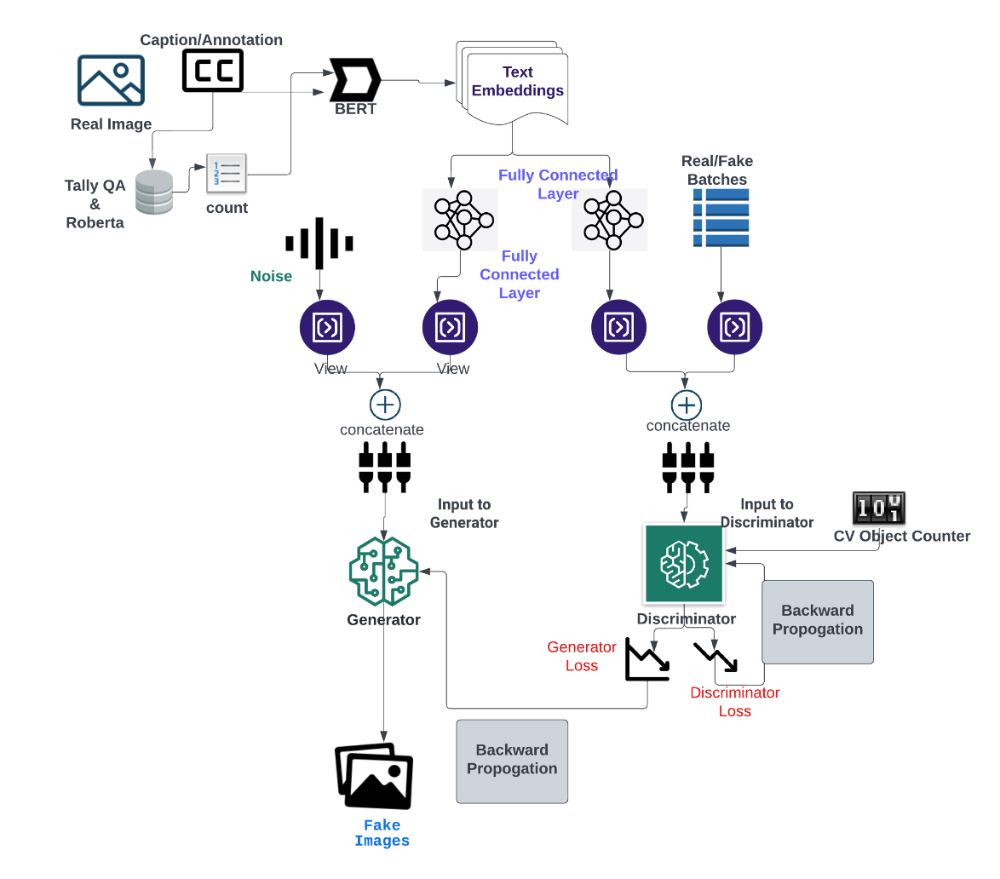

# T2I-with-quantitative-embeddings

## Results

## Architecture

### **Steps to reproduce the code**

Part1: Data preparation and feature extraction (Including BERT Text Embeddings)

- Step 1: Run the notebook. This notebook will work only on Colab [https://colab.research.google.com/drive/1C9wzPjyYUb0mOiuDlVCS8l86TsaQBdsD](https://colab.research.google.com/drive/1C9wzPjyYUb0mOiuDlVCS8l86TsaQBdsD)
- Step2: Run the script dataset_curation_part1.py . To do this ; the dataset needs to be downloaded from this link: [https://drive.google.com/drive/folders/1FhQARl68A9NjjIbpQ6ib28UQ6pcLUSXJ?usp=sharing](https://drive.google.com/drive/folders/1FhQARl68A9NjjIbpQ6ib28UQ6pcLUSXJ?usp=sharing)
    - Out of the Step 1 is used in this python file
    - And the path for animal images needs to be changed to the path of animal_images folder in your local. Code line 53.

**this neeeds to be replaced with the path where the images are saved**

destination = '/Volumes/GoogleDrive/Shared drives/MSML612 DeepLearningProject/data/animal_images'

### Part 2: CGAN training

- Step 1: Open the Congif.ini, setup an experiment with desired values and give an experiment name. The data_path variable should point to the relative path where the pickle file from the previous Part was generated.
- Step 2: Install the required packages and run the command $ python CGAN.py. This should start the training and should start saving the models, plots and generated images under the Experiments/<exp_name> Folder.
    
    Please note that since this a complex model, training was done on NVIDIA 16GB GPU enabled High Performance Cluster system and it still took about 1 hour to train per epoch and to see minimal results, atleast about 30 epochs of training needs to be done.
    

### Part 3: CGAN predictions

- The best model we trained was about 15 epochs due to the hardware constraints. Given that our qualitative dataset is relatively small, the results were vague but starting to form.
- To generate image on a desired text, in the notebook CGAN_Predicition.ipynb change the variable ‘TEXT’ to the desired sentence and run the entire notebook to generate the predicted image at the end.

### Special Mention: Lafite Code

- We tried implementing the Lafite code which is open source. It can be found in the Lafite directory. The pickle can be processed using dataset_tool.py by giving its path to the source in the script. The data has been generated in the ldata folder.
- Kindly go through the documentation of Lafite to setup the requirements.
- To run the Lafite training script, you need to run $ python train.py --outdir=./training_runs --data=./ldata --test_data=./ldata_test. (We faced issues running this due to CUDA issues).
- For Predicitons using Lafite, open the notebook Lafite/generate.ipynb and change the text to the required text. Run the notebook and the predictions should be loaded.
